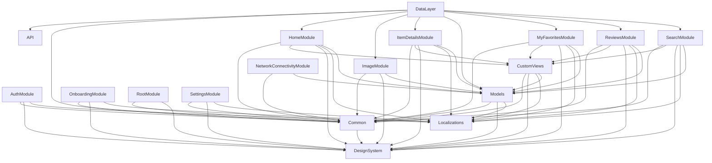

<!-- DO NOT EDIT: generated by module-graph from the Package.swift files and module-rules.json5. -->

```mermaid
graph TD
  %% AuthModule
  AuthModule --> Common
  AuthModule --> DesignSystem
  AuthModule --> Localizations

  %% Common
  Common --> DesignSystem

  %% CustomViews
  CustomViews --> Common
  CustomViews --> DesignSystem
  CustomViews --> Localizations
  CustomViews --> Models

  %% DataLayer
  DataLayer --> API
  DataLayer --> Common
  DataLayer --> HomeModule
  DataLayer --> ImageModule
  DataLayer --> ItemDetailsModule
  DataLayer --> Models
  DataLayer --> MyFavoritesModule
  DataLayer --> ReviewsModule
  DataLayer --> SearchModule

  %% HomeModule
  HomeModule --> Common
  HomeModule --> CustomViews
  HomeModule --> DesignSystem
  HomeModule --> Localizations
  HomeModule --> Models

  %% ImageModule
  ImageModule --> Common
  ImageModule --> DesignSystem
  ImageModule --> Models

  %% ItemDetailsModule
  ItemDetailsModule --> Common
  ItemDetailsModule --> CustomViews
  ItemDetailsModule --> DesignSystem
  ItemDetailsModule --> Localizations
  ItemDetailsModule --> Models

  %% Models
  Models --> Common
  Models --> DesignSystem
  Models --> Localizations

  %% MyFavoritesModule
  MyFavoritesModule --> Common
  MyFavoritesModule --> CustomViews
  MyFavoritesModule --> DesignSystem
  MyFavoritesModule --> Localizations
  MyFavoritesModule --> Models

  %% NetworkConnectivityModule
  NetworkConnectivityModule --> Common
  NetworkConnectivityModule --> Models

  %% OnboardingModule
  OnboardingModule --> Common
  OnboardingModule --> DesignSystem
  OnboardingModule --> Localizations

  %% ReviewsModule
  ReviewsModule --> Common
  ReviewsModule --> CustomViews
  ReviewsModule --> DesignSystem
  ReviewsModule --> Localizations
  ReviewsModule --> Models

  %% RootModule
  RootModule --> Common
  RootModule --> DesignSystem

  %% SearchModule
  SearchModule --> Common
  SearchModule --> CustomViews
  SearchModule --> DesignSystem
  SearchModule --> Localizations
  SearchModule --> Models

  %% SettingsModule
  SettingsModule --> Common
  SettingsModule --> DesignSystem
  SettingsModule --> Localizations
```
